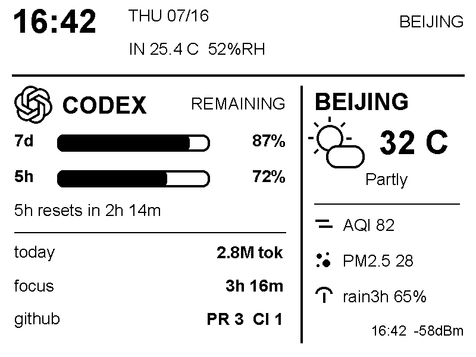

# Codex 工作台状态屏（ESP32-S3-RLCD-4.2）

基于 [CEJXXX/token-monitor-RLCD](https://github.com/CEJXXX/token-monitor-RLCD) 改造，
硬件保持为 Waveshare ESP32-S3-RLCD-4.2、板载 SHTC3 与 2.4 GHz Wi-Fi。



## 屏幕内容

- Codex 周期额度剩余百分比与重置倒计时；
- 今日 tokens，以及按 15 分钟活动簇估算的今日专注时长；
- 北京实时天气、AQI、PM2.5；
- 未来 3 小时降雨概率：达到阈值时替换风速，平时不制造噪音；
- 可选 GitHub 待 Review PR 数与默认分支异常 CI 数；
- Bridge 最近同步时间和 Wi-Fi RSSI，断联时显示 `STALE`；
- 本地日期时间与板载室内温湿度。

未配置 GitHub 时，对应行自动回退为最近任务 tokens。专注时长直接从本机
Codex 活动时间估算，因此不需要日历授权。

## 数据链路

```text
~/.codex/sessions/**/*.jsonl       Open-Meteo / CAMS
             \                         /
              +---- Python bridge ----+---- GitHub REST（可选）
                         :7777
                           |
                    ESP32-S3 + LVGL
```

Bridge 只读取 Codex 会话日志中的 `token_count` 数据，不读取 Codex 登录凭据。
GitHub token 只保存在 Bridge 主机的 `.env` 中，不会返回给 ESP32。

## 1. 启动 Bridge（Windows）

安装 Python 3.10+ 或 [uv](https://docs.astral.sh/uv/)，然后：

```powershell
Copy-Item bridge\.env.example bridge\.env
notepad bridge\.env
scripts\start-bridge-windows.ps1
```

至少应替换 `RLCD_AUTH_TOKEN`。北京坐标、天气缓存和 30% 降雨提醒阈值已有默认值。

### 可选 GitHub 模块

在 `bridge/.env` 中设置：

```dotenv
GITHUB_TOKEN=github_pat_xxx
RLCD_GITHUB_REPOS=MaoYun98/codex-token-monitor-rlcd,owner/another-repo
RLCD_GITHUB_TTL=300
```

建议使用只读 Fine-grained PAT，仅授权选定仓库的 Metadata、Pull requests 和
Actions 读取权限。PR 数表示请求当前 token 所属用户 Review 的开放 PR；CI 数表示
各仓库默认分支上“每个工作流最新一次运行”仍失败的数量。

验证接口：

```powershell
Invoke-RestMethod 'http://localhost:7777/api/usage?mock=1' `
  -Headers @{ 'X-RLCD-Token' = $env:RLCD_AUTH_TOKEN }
```

## 2. 编译与烧录

从开始菜单打开 ESP-IDF 5.x PowerShell：

```powershell
Set-Location firmware
Copy-Item main\secrets.h.example main\secrets.h
notepad main\secrets.h
idf.py set-target esp32s3
idf.py build flash monitor
```

在 `secrets.h` 中填写 2.4 GHz Wi-Fi、Bridge 局域网 URL，以及与
`RLCD_AUTH_TOKEN` 相同的 token。首次可把 URL 改为 `.../api/usage?mock=1`。

## 3. 自检

```powershell
bridge\.venv\Scripts\python.exe -m unittest discover -s bridge\tests -v
bridge\.venv\Scripts\python.exe -m compileall -q bridge
```

## 安全与数据来源

- Bridge 监听 `0.0.0.0` 时必须设置 `RLCD_AUTH_TOKEN`，不要把 7777 暴露到公网；
- `bridge/.env` 与 `firmware/main/secrets.h` 已加入 `.gitignore`；
- 天气来自 [Open-Meteo](https://open-meteo.com/en/docs)，空气质量数据基于
  Copernicus Atmosphere Monitoring Service（CAMS）全球预报；
- Codex 标识参考 [OpenAI 官方 Codex 页面](https://openai.com/codex/)，相关标识为
  OpenAI 商标，本项目单色版本仅用于个人硬件状态屏。

上游项目声明采用 MIT License；本改造保留相同许可边界。
